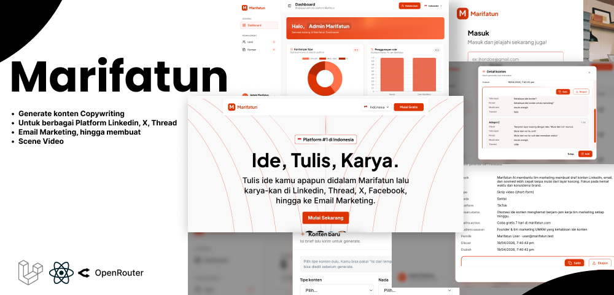

# Marifatun Frontend

<p align="center">
  
</p>

## Deskripsi

Marifatun merupakan kosakata yang diambil dari Arab yang mengartikan Pengetahuan, dengan tujuan untuk melakukan generating copywriting konten yang dapat di share di LinkedIn, X, Thread, Facebook, hingga ke Email Marketing. Dan juga melakukan scripting scenes untuk membuat Video.

**Markdown:**

```markdown

```

## Instalasi

Pastikan di komputer lokal sudah terpasang:

- **Node.js** versi **v25.9.0**
- **Bun** versi **1.3.11**

Langkah menjalankan project:

```bash
cd marifatun-frontend
bun install
bun dev
```

Buka di browser: [http://localhost:5173/](http://localhost:5173/)
